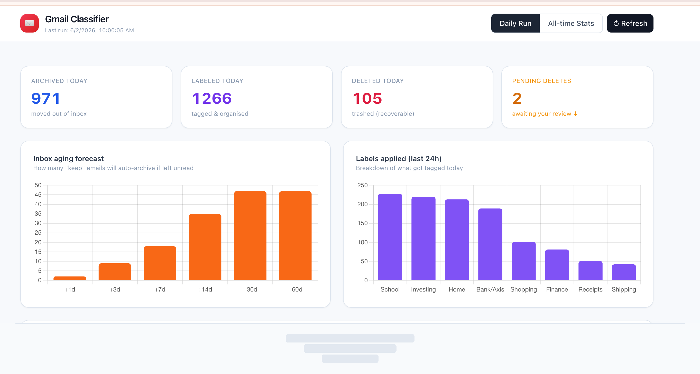
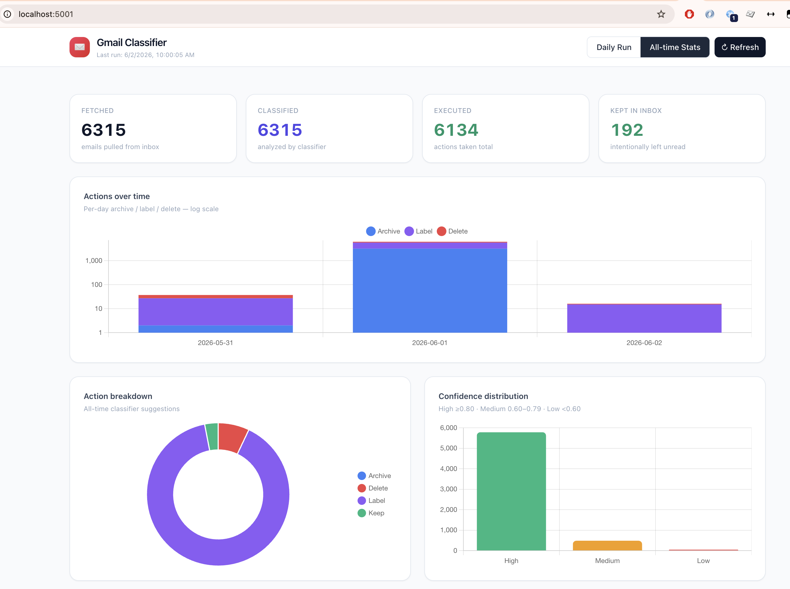
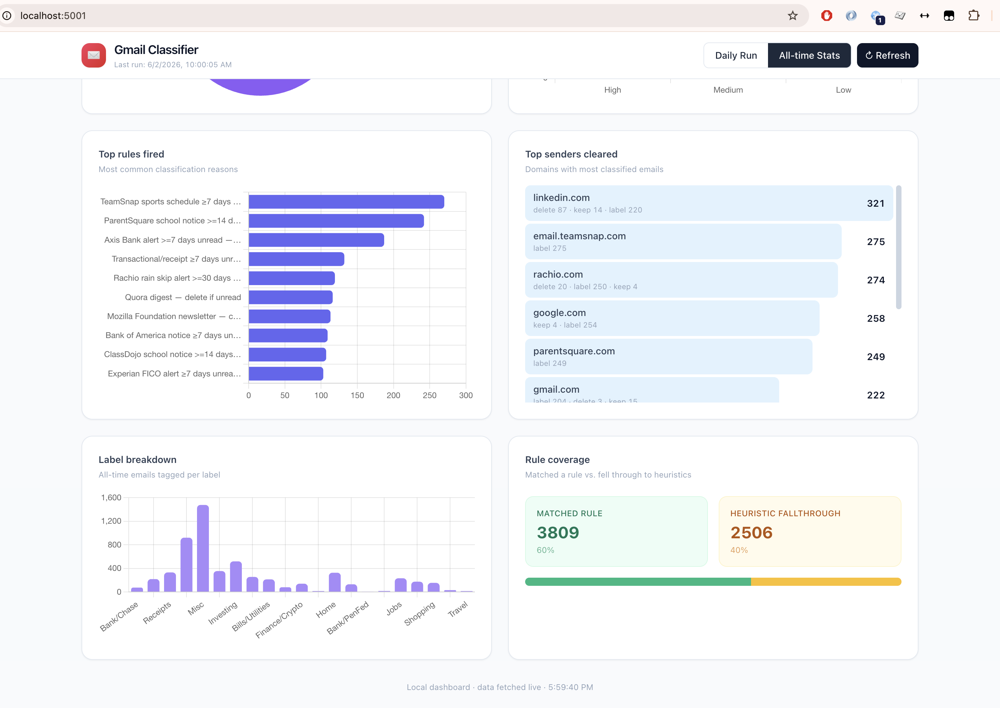
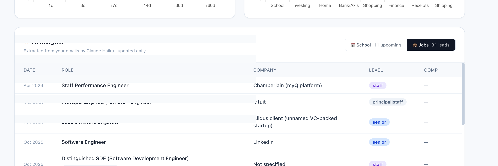
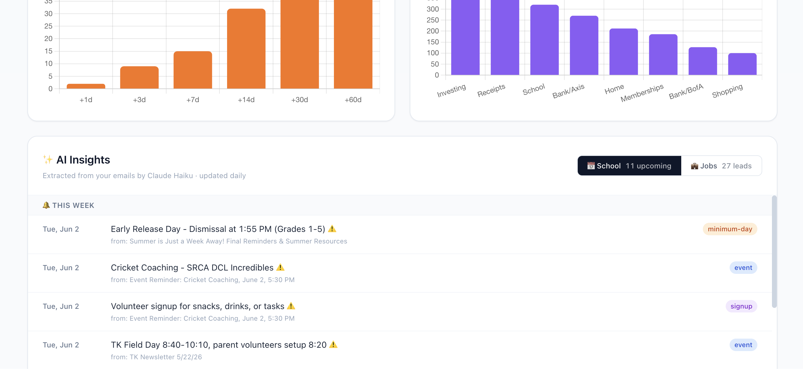

# Gmail Classifier

Rule-based Gmail inbox cleanup with Claude Haiku for uncertain emails, daily automation, and a local dashboard. Built to clear a personal inbox with 5,000+ unread emails — now runs daily via launchd.

**No agents, no cloud infra, no subscription.** Runs entirely locally. The rule-based classifier is completely free; AI features are optional and cost fractions of a cent on most days once your rules are tuned.

## Screenshots

**Daily Run tab** — summary cards, inbox aging forecast, labels applied this run



**All-time Stats** — action timeline, breakdown, confidence distribution, top rules and senders




**AI Insights — Jobs tab** — structured job leads extracted from recruiter emails



**AI Insights — School tab** — upcoming school events extracted from newsletters



## What it does

- **Fetches** unread email metadata from Gmail API in batches
- **Classifies** each email using 550+ sender rules with confidence scores
- **Executes** safe actions automatically (archive, label) at ≥ 0.75 confidence
- **Holds deletes** for manual review — never auto-deletes without explicit approval
- **Extracts** structured data from newsletters (school calendar events) and recruiter emails (job leads) via Claude Haiku
- **Tracks everything** in a local dashboard at `http://localhost:5001`

## How it works

```
fetch_unread.py  →  classify.py  →  execute_actions.py
                         ↓
                   LLM of your choice     (optional, fractions of a cent/run)
                   uncertain emails only
                         ↓
         extract_school_events.py / extract_job_leads.py
                         ↓
                   dashboard/dashboard.py
```

**Two-pass execution model:**
- Pass 1 (automatic): archive + label at confidence ≥ 0.75
- Pass 2 (manual only): deletes after you review and explicitly approve

## Quick start

### 1. Google Cloud OAuth setup

1. Go to [Google Cloud Console](https://console.cloud.google.com/)
2. Create a project, enable Gmail API
3. Create OAuth 2.0 credentials → Desktop app → download as `credentials.json` in this directory
4. Scopes needed: `gmail.readonly` (fetch) + `gmail.modify` (execute actions)

### 2. Python environment

```bash
python3 -m venv venv
source venv/bin/activate
pip install -r requirements.txt
```

### 3. First auth + fetch

```bash
# Opens browser for OAuth, then fetches your first 50 emails
venv/bin/python scripts/fetch_unread.py --batch 001 --limit 50
```

### 4. Classify

```bash
venv/bin/python scripts/classify.py \
  --input data/batch-001.csv \
  --output data/batch-001-classified.json
```

### 5. Execute safe actions (no deletes)

```bash
venv/bin/python scripts/execute_actions.py \
  --input data/batch-001-classified.json \
  --confidence-threshold 0.75
```

### 6. Dashboard

```bash
venv/bin/python dashboard/dashboard.py
# → http://localhost:5001
```

## Using with Claude Code (or any AI assistant)

The preferred way to use this project day-to-day is conversationally — no memorizing commands needed.

```bash
cd gmail-classifier
claude   # Claude Code CLI, or open in Cursor / Windsurf / Copilot Chat
```

Then just ask in plain English:

> "Fetch and classify a new batch"

> "Show me what's pending deletion before I approve anything"

> "Add a rule to archive all emails from @substack.com after 7 days"

> "What school events are coming up in the next 2 weeks?"

> "Run the daily pipeline and tell me what happened"

The AI reads the files, runs the scripts, and reports back. It will never execute deletes without showing you the list first.

See **[CLAUDE.md](CLAUDE.md)** for the full guide — example prompts, safety rules, model configuration, and which files the AI reads most often.

### Choosing your AI model

The interactive session (Claude Code etc.) uses whatever model you configure in your editor — this is separate from the model used by the scripts.

For **script-level AI** (uncertain email classification, school events, job leads), set `GMAIL_AI_MODEL` to any [litellm-supported model string](https://docs.litellm.ai/docs/providers). The scripts fall back to rule-only mode if no API key is available.

## Daily automation

`daily_run.sh` runs the full pipeline: fetch new emails → classify → re-classify all batches (age gates fire on older emails) → execute safe actions → extract AI insights.

```bash
./daily_run.sh            # rule-based only
./daily_run.sh --with-ai  # also send uncertain emails to Claude Haiku
```

Schedule on macOS via launchd — see `com.YOURNAME.gmail-classifier.plist.example` for a template.

## Classification rules

Rules live in two files:

| File | Committed | Purpose |
|---|---|---|
| `scripts/classification_rules.base.json` | ✅ | 550+ domain/pattern rules — the shared core |
| `scripts/classification_rules.personal.json` | ❌ gitignored | Your personal sender overrides |

Copy the example to get started:
```bash
cp scripts/classification_rules.personal.example.json \
   scripts/classification_rules.personal.json
```

Personal rules are checked first (first-match-wins), then base rules. The base ruleset covers newsletters, receipts, recruiters, notifications, travel, finance, shopping, and more.

### Rule format

```json
{
  "from_match": "@github.com",
  "action": "label",
  "label": "Dev",
  "reasoning": "GitHub notifications"
}
```

Optional fields: `subject_match`, `min_age_days`, `max_age_days`, `label`, `archive_after_label`.

Actions: `keep` · `archive` · `label` · `delete`

### Age gates

Rules can fire differently based on email age:

```json
[
  { "from_match": "@newsletter.com", "action": "keep", "max_age_days": 7 },
  { "from_match": "@newsletter.com", "action": "archive", "min_age_days": 7 }
]
```

Re-classifying all batches daily means emails automatically age into archive as they get older — no manual work needed.

## AI features (optional)

AI features use [litellm](https://github.com/BerriAI/litellm) — set `GMAIL_AI_MODEL` to any supported model string and the matching provider API key. Defaults to Claude Haiku if not set.

```bash
# Anthropic (default)
export ANTHROPIC_API_KEY=sk-ant-...
export GMAIL_AI_MODEL=claude-haiku-4-5-20251001

# OpenAI
export OPENAI_API_KEY=sk-...
export GMAIL_AI_MODEL=gpt-4o-mini

# Google Gemini
export GEMINI_API_KEY=...
export GMAIL_AI_MODEL=gemini/gemini-1.5-flash

# Groq (fast + cheap)
export GROQ_API_KEY=...
export GMAIL_AI_MODEL=groq/llama-3.1-8b-instant

# Local Ollama (free, no API key)
export GMAIL_AI_MODEL=ollama/llama3
```

| Feature | How to invoke | What it does |
|---|---|---|
| Uncertain email review | `--with-ai` flag on `classify.py` | Sends emails < 0.75 confidence to LLM |
| School calendar | `extract_school_events.py` | Extracts upcoming events from newsletters |
| Job leads pipeline | `extract_job_leads.py` | Extracts role/company/comp from recruiter emails |

All extractors are idempotent — already-processed message IDs are skipped on subsequent runs.

## Dashboard

**Daily Run tab**: actions this run, inbox aging forecast, labels applied, AI insights (school calendar + job pipeline).

**All-time Stats tab**: action breakdown, confidence distribution, top rules, top senders, timeline chart.

## Safety

- Deletes **never** auto-execute — require explicit `--only-deletes` flag
- Every action logged to `logs/actions-TIMESTAMP.jsonl` with full metadata
- Execution is idempotent — re-running any batch skips already-executed emails
- Confidence thresholds are configurable; default is conservative (0.75 safe actions, 0.97 deletes)

## File structure

```
gmail-classifier/
├── scripts/
│   ├── fetch_unread.py                       # Gmail API fetcher
│   ├── classify.py                           # Rule engine + optional AI pass
│   ├── execute_actions.py                    # Executor with audit log
│   ├── extract_school_events.py              # School calendar extraction
│   ├── extract_job_leads.py                  # Job leads extraction
│   ├── classification_rules.base.json        # Committed: shared rules
│   ├── classification_rules.personal.json    # Gitignored: your rules
│   └── classification_rules.personal.example.json
├── dashboard/
│   ├── dashboard.py                          # Local HTTP server
│   └── templates/dashboard.html
├── daily_run.sh                              # Full pipeline script
├── requirements.txt
└── .gitignore
```

## Requirements

- Python 3.10+
- Google Cloud project with Gmail API enabled
- API key for your chosen LLM provider (only for AI features — optional)

## Dashboard API

The dashboard is a stdlib `http.server` app (no Flask) serving a single page and three JSON endpoints.

### `GET /api/stats`

Aggregate stats across all batches.

```json
{
  "totals": { "fetched": 95, "classified": 95, "executed": 0, "remaining": 95 },
  "actions": { "archive": 2, "delete": 10, "label": 39, "keep": 44 },
  "confidence_buckets": { "high": 89, "medium": 3, "low": 3 },
  "labels": { "Receipts": 4, "Chase": 6, "Finance": 2, ... },
  "top_rules": [ { "reasoning": "Costco marketing newsletter", "count": 12 }, ... ],
  "top_senders": [ { "domain": "chase.com", "count": 8, "actions": { "label": 8 } }, ... ],
  "rule_coverage": { "matched_rule": 88, "fell_through_heuristic": 7 }
}
```

- `confidence_buckets`: high ≥ 0.80, medium 0.60–0.79, low < 0.60
- `top_rules` / `top_senders`: top 10 each by count
- `remaining` = classified − executed

### `GET /api/deletions`

Emails marked for deletion, joined with metadata, sorted by confidence ascending (most uncertain first).

```json
[
  {
    "message_id": "19e7...",
    "batch": "004",
    "from_email": "noreply@example.com",
    "from_name": "Example Sender",
    "subject": "The deal you viewed is now on sale",
    "date": "Fri, 30 May 2026 10:00:00 -0700",
    "age_days": 1,
    "confidence": 0.95,
    "reasoning": "Marketing newsletter — delete"
  }
]
```

### `POST /api/rescue`

Rescue an email from the delete queue (changes its action to `keep`).

Request body:
```json
{ "message_id": "19e7...", "batch": "004" }
```

Response:
```json
{ "ok": true, "message_id": "19e7..." }
```

Returns HTTP 400/404 with `{ "ok": false, "error": "..." }` on failure.

## License

MIT
